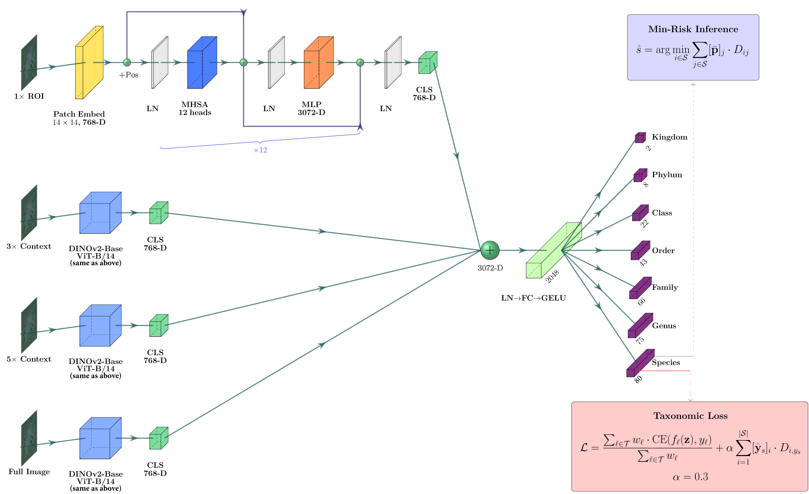

# Taxonomy-aware deep learning for hierarchical marine species classification

Reference implementation for:

> Zimmerman, D., Pados, D. A., and Sklivanitis, G.,
> "Taxonomy-aware deep learning for hierarchical marine species classification in underwater imagery,"
> in *Proc. SPIE 14030, Machine Learning from Challenging Data 2026* (Defense + Commercial Sensing), 2026.

The framework aligns the training loss, inference rule, and ensemble strategy with the FathomNet 2025 tree-path-distance metric. On the FathomNet 2025 public test set it achieves a mean tree-path distance of **1.581**, within 3% of the 1st-place solution.

## Method (in three components)

1. **Multi-scale DINOv2 backbone with LLRD.** Four ROI crops at 1×, 3×, 5×, and full-image scales are fed to four independent DINOv2-Base ViT-B/14 encoders, fine-tuned with layer-wise learning-rate decay (γ = 0.7). The four CLS tokens are concatenated (3072-dim) and projected to a 2048-dim fused embedding feeding seven taxonomic-rank classification heads.
2. **Taxonomy-aware loss.** A weighted cross-entropy across all seven heads plus an expected tree-distance penalty on the species head (α = 0.3): `L = (Σ_ℓ w_ℓ · CE_ℓ) / Σ w_ℓ + α · Σ_i p_i · D_{i, y}`.
3. **Minimum-risk inference.** A 10-fold ensemble averages species softmaxes; the prediction selects `argmin_i Σ_j p_j · D_{i,j}` — the Bayes-optimal decision under the tree-path cost.



*End-to-end pipeline: four ROI scales → independent DINOv2-Base ViT-B/14 backbones → CLS-token concatenation → 2048-dim fused embedding → seven per-rank heads. Trained with the taxonomy-aware loss; decoded with minimum-risk inference over a 10-fold ensemble. Vector version: [`docs/architecture.pdf`](docs/architecture.pdf).*

## Repository layout

```
src/
  losses.py                    # taxonomy-aware loss (Eq. 2 of the paper)
  config.py                    # OmegaConf wrapper
  models/
    dinov2_backbone.py         # ViT-B/14 wrapper with LLRD parameter groups
    model_multiscale_taxloss.py  # headline model (4 scales, 7 heads)
    model_multiscale.py        # multiscale base (no tax-loss)
    model_multiscale_attention*.py  # attention-fusion ablations (§4.1)
    attention_module.py, hierarchy_fusion.py  # fusion variants
    model_simple.py, model.py  # single-scale baselines
  training/
    train_multiscale_taxloss.py  # primary training entry
    train_kfold.py               # k-fold cross-validation runner
    train_attention_taxloss.py   # attention-fusion ablation runner
  inference/
    ensemble_predict.py            # 10-fold ensemble averaging
    generate_submission_taxloss.py # min-risk decoding -> submission CSV
    generate_submission_multiscale.py, generate_submission_attention.py
    evaluate_on_test.py            # tree-path-distance evaluation
data/
  data.py                      # COCO-style dataset + ROI loaders
  download.py                  # FathomNet 2025 raw download helper
  create_*_rois.py             # multi-scale ROI extraction from raw images
  taxonomy.csv                 # 80-leaf hierarchy (kingdom -> species)
  distance_matrix.csv          # 80x80 pairwise tree-path distances
  ground_truths.csv            # public test-set labels
  dataset_train.json, dataset_test.json  # COCO splits used in the paper
config/
  experiment-multiscale.yaml         # multiscale baseline config
  experiment-dinov2.yaml             # DINOv2 + LLRD (headline)
  experiment-dinov2-small.yaml       # DINOv2-Small variant (§6 discussion)
  experiment-weights-1000x.yaml      # weight-rescaling sanity check
  experiment-external-val*.yaml      # external 5,802-sample evaluation
scripts/
  bootstrap_confidence.py            # BCa bootstrap CIs (§6.1)
  cross_validated_calibration.py     # OOF temperature scaling (§6 discussion)
  calibration_analysis.py            # ECE / reliability diagrams
  posthoc_hierarchy_repair.py        # negative-result baseline (§6 discussion)
  domain_shift_analysis.py           # train/test ROI statistics (§5)
  per_level_analysis.py              # per-rank accuracy breakdown
  analyze_per_rank_errors.py
  plot_alpha_sensitivity.py          # α sweep figure
  plot_label_distribution.py
  compute_consistency.py
  compare_models.py
  download_fathomnet_external.py     # external-validation set assembly
  run_alpha_sweep_10fold.sh
  run_fusion_ablation.sh             # attention-fusion sweep (§6.1)
  run_hxe_ablation.sh                # HXE comparison (§2)
  run_weight_ablation.sh
```

## Setup

```bash
git clone https://github.com/C2A2-at-Florida-Atlantic-University/fathomnet-taxonomy.git
cd fathomnet-taxonomy
pip install -r requirements.txt
pip install -e .
```

Tested with Python 3.10, PyTorch 2.1+, CUDA 12.1, on a single NVIDIA H200 GPU.

## Reproducing the headline result (1.581)

### 1. Download the data

```bash
python data/download.py            # pulls FathomNet 2025 ROIs to ./train/ and ./test/
python data/create_multiscale_rois.py  # extracts 1x / 3x / 5x / full crops
```

### 2. Train the 10-fold ensemble

```bash
python -m src.training.train_kfold \
    --config config/experiment-dinov2.yaml \
    --num-folds 10
```

Each fold takes roughly 2 GPU-hours on an H200 (16-bit mixed precision, batch size 12). All 10 folds run in serial fit within ~24 GPU-hours.

### 3. Generate ensemble predictions with minimum-risk inference

```bash
python -m src.inference.generate_submission_taxloss \
    --config config/experiment-dinov2.yaml \
    --checkpoints outputs/kfold_10fold_dinov2_llrd/fold_*/checkpoints/*.ckpt \
    --output submission.csv
```

### 4. Evaluate

```bash
python -m src.inference.evaluate_on_test \
    --predictions submission.csv \
    --ground-truth data/ground_truths.csv
```

Expected mean tree-path distance: **1.581** (95% bootstrap CI [1.376, 1.805]).

## Reproducing the ablations

| Component | Script |
|---|---|
| α sensitivity (Fig. in §6.1) | `bash scripts/run_alpha_sweep_10fold.sh` |
| Loss-weight rescaling | `bash scripts/run_weight_ablation.sh` (uses `config/experiment-weights-1000x.yaml`) |
| Attention-fusion variants (§6.1) | `bash scripts/run_fusion_ablation.sh` |
| HXE comparison (§2) | `bash scripts/run_hxe_ablation.sh` |
| Bootstrap CIs / paired bootstrap | `python scripts/bootstrap_confidence.py` |
| Cross-validated temperature scaling (§6) | `python scripts/cross_validated_calibration.py --checkpoint-dir outputs/...` |
| Post-hoc hierarchy-repair baseline (§6) | `python scripts/posthoc_hierarchy_repair.py` |
| External 5,802-sample replication (Table 5) | `python scripts/download_fathomnet_external.py` then re-run inference with `config/experiment-external-val*.yaml` |

## Citation

```bibtex
@inproceedings{zimmerman2026taxonomy,
  author    = {Dan Zimmerman and Dimitris A. Pados and George Sklivanitis},
  title     = {Taxonomy-aware deep learning for hierarchical marine species classification in underwater imagery},
  booktitle = {Proc. SPIE 14030, Machine Learning from Challenging Data 2026},
  year      = {2026},
  organization = {SPIE Defense + Commercial Sensing}
}
```

## Acknowledgments

This work was conducted at the Center for Connected Autonomy and AI (CAAI), Florida Atlantic University. D.Z. is supported by the DoD SMART Scholarship-for-Service Program.

We thank the FathomNet team and the Kaggle / CVPR-FGVC organizers for the FathomNet 2025 dataset.

## License

MIT — see [LICENSE](LICENSE).
